class: center, middle

# CME 213, ME 339 - Winter 2020

## Eric Darve, ICME


“If debugging is the process of removing bugs, then programming must be the process of putting them in.”
(Edsger W. Dijkstra)

---
class: middle, center

Before we start...

Download from `Code/`

[Code/create_vm_gpu1.sh](https://github.com/stanford-cme213/stanford-cme213.github.io/blob/master/Code/create_vm_gpu1.sh)

Run 

```
$ ./create_vm_gpu1.sh
```

on your laptop.

---
class: middle

CME 213 so far:

- C++ threads
- OpenMP: `for` loop and `task`
- Sorting algorithms on shared memory

Onwards to GPU computing!

---
class: middle, center


---
class: middle, center

Reference

https://github.com/karlrupp/cpu-gpu-mic-comparison

https://www.karlrupp.net/2013/06/cpu-gpu-and-mic-hardware-characteristics-over-time/

https://www.karlrupp.net/2015/06/40-years-of-microprocessor-trend-data/

---
class: middle, center

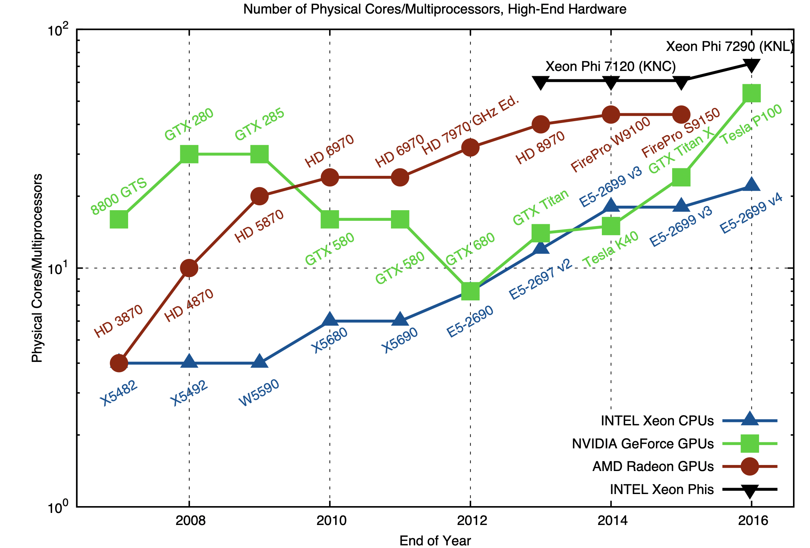

---
class: middle, center

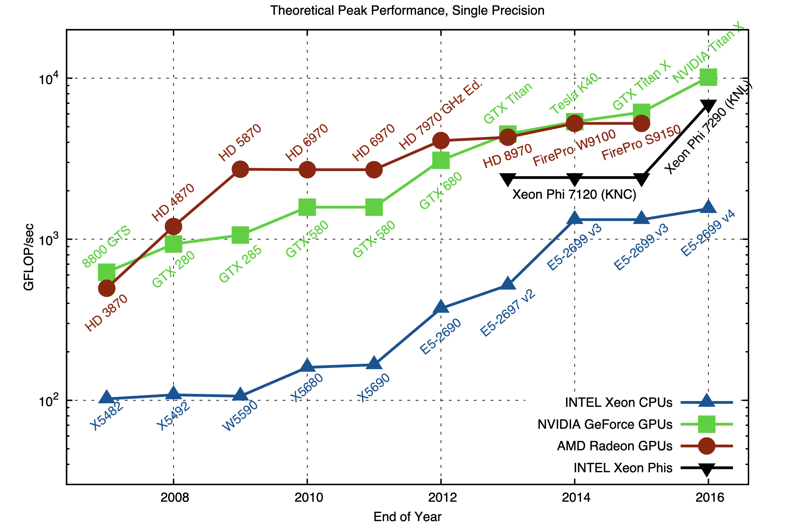

---
class: middle, center

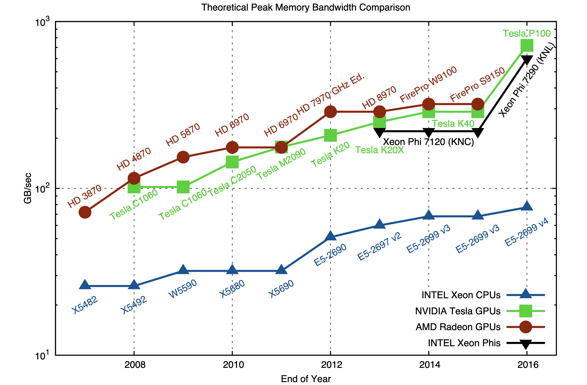

---
class: middle, center

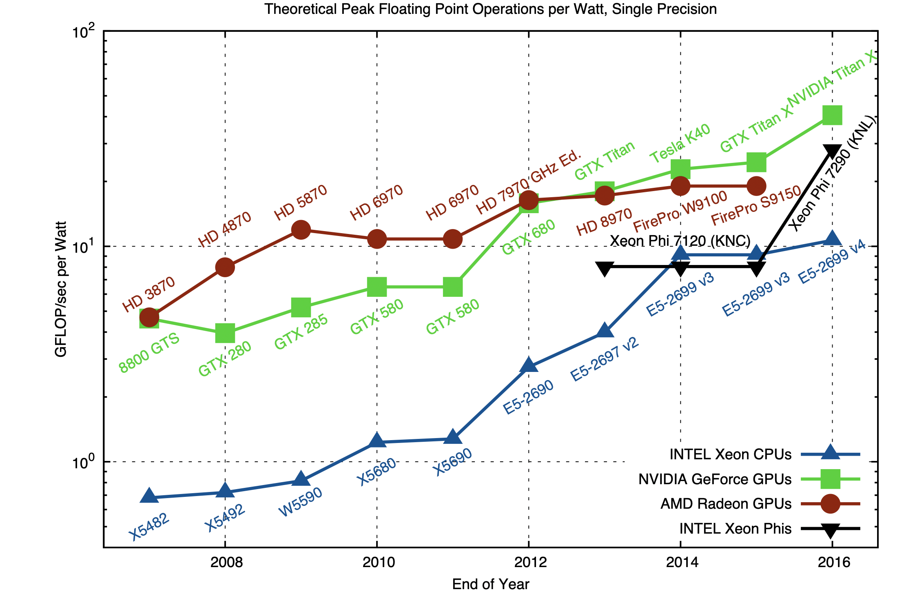

---
class: middle, center

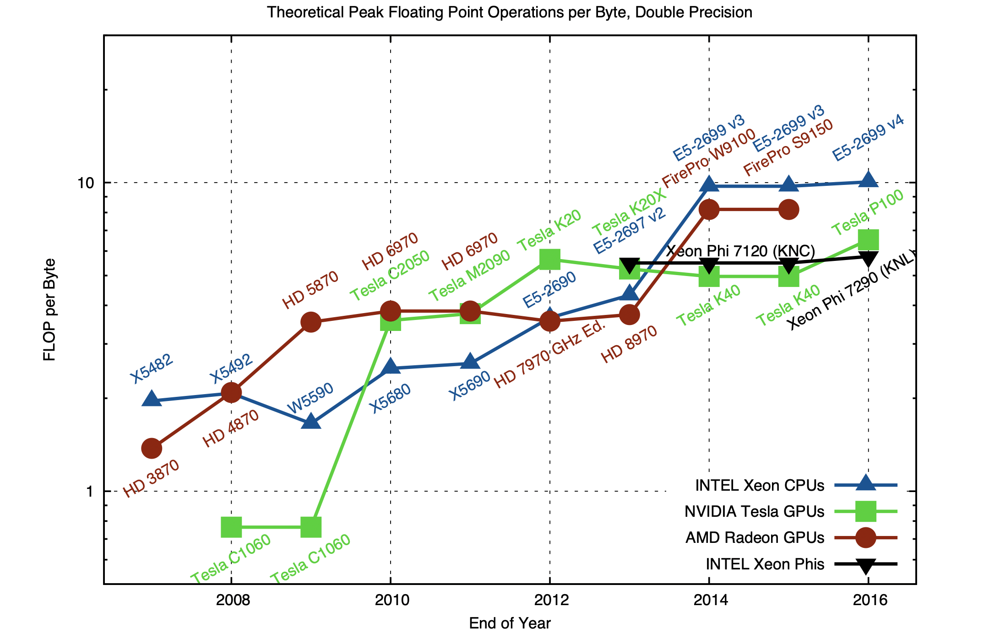

---
class: img-right

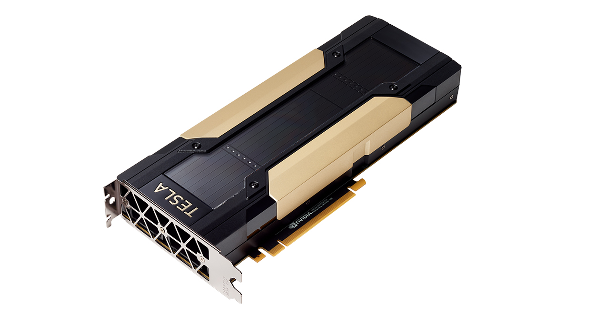

# Example: Volta V100

- 8.2 teraflops double-precision performance
- 16.4 teraflops single-precision performance
- 130 teraflops for tensor (deep learning)
- 1134 GB/sec memory bandwidth
- 250 Watts power

---
class: middle, center

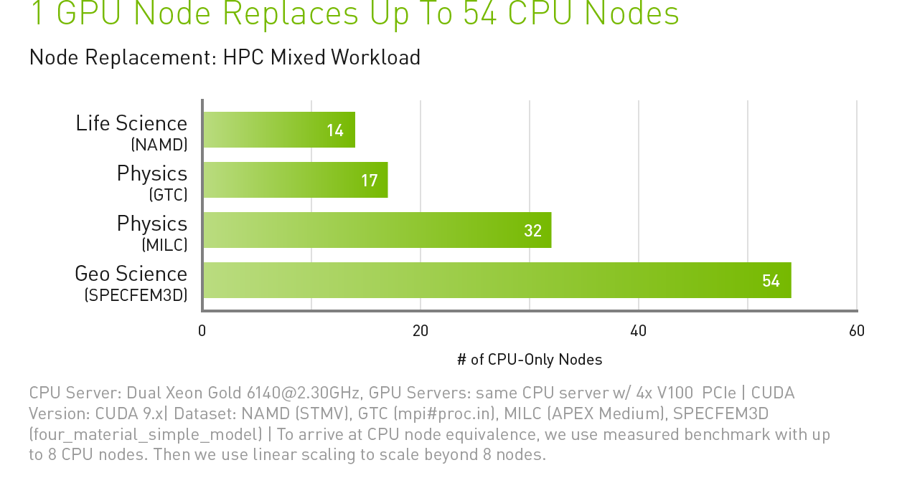

---
class: middle, center


---
class: middle, center

# What is the technology behind GPU processors?

---
class: middle, center

It’s started with 3D graphics


---
class: middle, center

GPUs were designed to perform the same instruction on a large amount of data

Graphics processing == scientific computing

---
class: img-right


The multicore processor

Fast processor because:
- Pipelining of execution
- Out of order execution
- Branch prediction
- Pre-fetching
- Large amount of multilevel cache
- ...

---
class: img-right


The GPU processor

Many computing units operating in parallel

Ideal for simple but repetitive tasks

---
class: middle

Great for:
- Dense linear algebra
- Finite-difference
- Neural network

Bad when calculation involves branching

---
class: center, middle

# The secret behind the magic

Striking the right trade-off

More computing units means you need to give up something

---
class: middle

- No processor space dedicated to complex optimizations, e.g., out-of-order execution
- Cache/memory is limited because it has to be shared amongst the threads

---
class: middle

- Light threads: hardware supports the ability to switch threads every cycle
- Limited logic for program control: 32 threads are grouped into warps; all threads in warp execute the same instruction at the same time.

---
class: middle, center

Each computing unit is less powerful but there are more of them.

---
class: middle, center

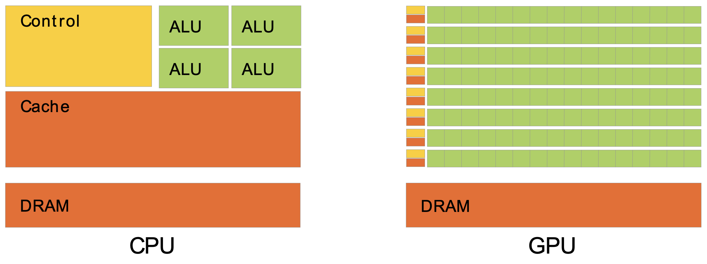

---
class: middle, center

Micro-architecture | Release | Compute Capability | GPU code name
--- | --- | --- | ---
G70 | 2005 | |
Tesla | 2006 | 1.0-1.3 | GXX, GT2XX
Fermi | 2010 | 2.0-2.1 | GFXXX
Kepler | 2012 | 3.0-3.7 | GKXXX
Maxwell | 2014 | 5.0–5.3 | GMXXX
Pascal | 2016 | 6.0-6.2 | GPXXX
Volta | 2017 | 7.0-7.2 | GVXXX
Turing | 2018 | 7.5 | TUXXX
Ampere | 2020 | 8.0? |

<!-- https://en.wikipedia.org/wiki/CUDA
https://en.wikipedia.org/wiki/List_of_Nvidia_graphics_processing_units
https://en.wikipedia.org/wiki/Tesla_(microarchitecture)
https://en.wikipedia.org/wiki/Fermi_(microarchitecture)
https://en.wikipedia.org/wiki/Kepler_(microarchitecture)
https://en.wikipedia.org/wiki/Maxwell_(microarchitecture)
https://en.wikipedia.org/wiki/Pascal_(microarchitecture)
https://en.wikipedia.org/wiki/Ampere_(microarchitecture) -->

---
class: center, middle


<!-- http://old.vgamuseum.info/history-tree.html -->

---
class: center, middle

# K80 on Google Cloud Platform

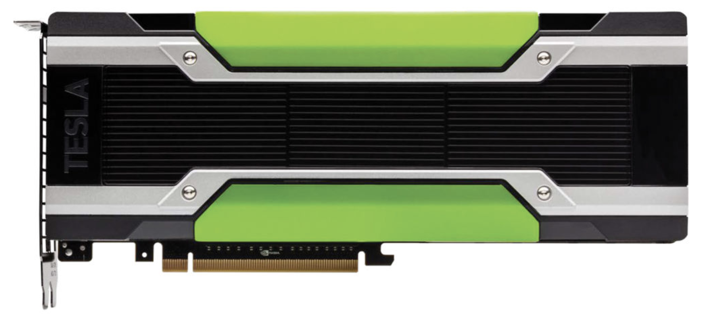

K80 is a dual GPU unit which utilizes two GK210B chipsets

---
class: middle

- 13 SMX
- 2,496 cores (192 per SMX)
- Total global memory: 12 GB
- Bandwidth: 241 GB/sec
- Peak performance: single 4,113  Gflop/sec; double 1,371 Gflop/sec
- Compute capability: 3.7
- Power: 300 W
- Boost clock: 824 MHz
- Architecture: Kepler 2.0; release: Nov 17th, 2014
- L1 Cache: 16 KB (per SMX); L2 Cache: 1,536 KB

<!-- https://www.techpowerup.com/gpu-specs/tesla-k80.c2616 -->

---
class: center, middle

NVIDIA GPUs are different from conventional processors. 

They only work as co-processors.

This means you need a host processor (e.g., Intel Xeon).

---
class: center, middle

Your program runs on the host and uses the CUDA API to move data back and forth to the GPU and run programs on the GPU.

You cannot log on the GPU directly or run an OS on the GPU.

---
class: center, middle

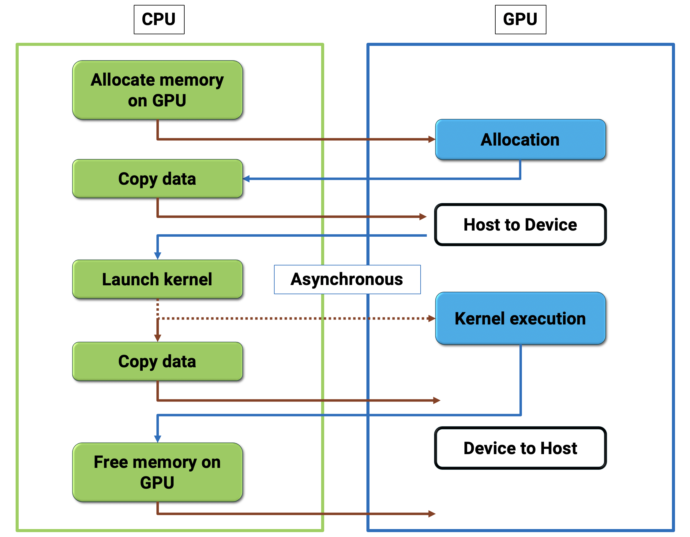

---
class: center, middle

You cannot program a GPU without understanding the architecture of the processor.

---
class: center, middle

GK210, aka K80, architecture

---
class: center, middle


---
class: center, middle

SMX

192 single-precision CUDA cores

64 double-precision units

32 special function units (SFU)

32 load/store units (LD/ST)

---
class: center, middle

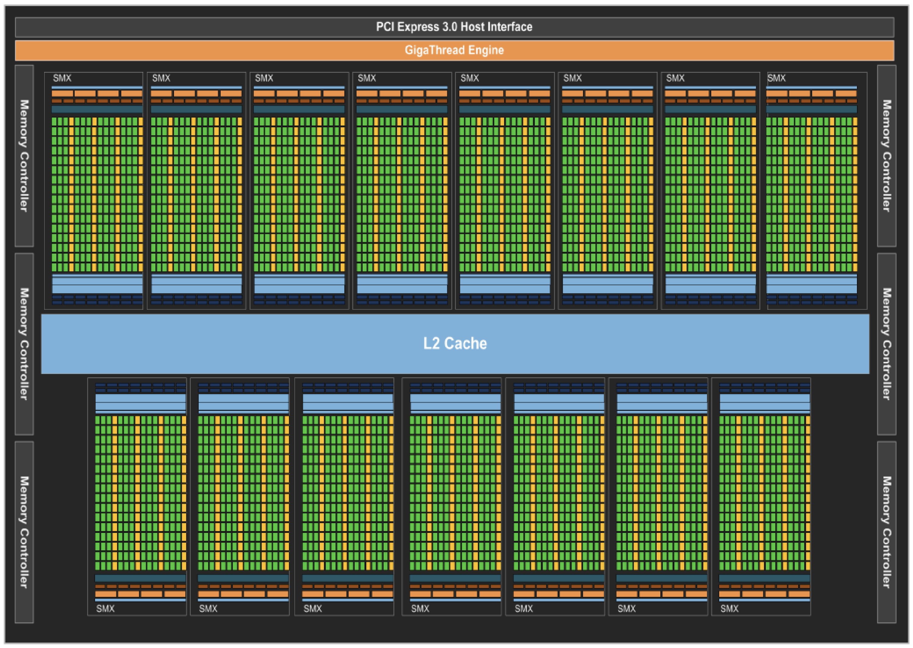

---
class: center, middle

# Volta!

# More, Better!

<!-- https://images.nvidia.com/content/volta-architecture/pdf/volta-architecture-whitepaper.pdf -->

---
class: center, middle

# Volta GV100 Streaming Multiprocessor

---
class: center, middle

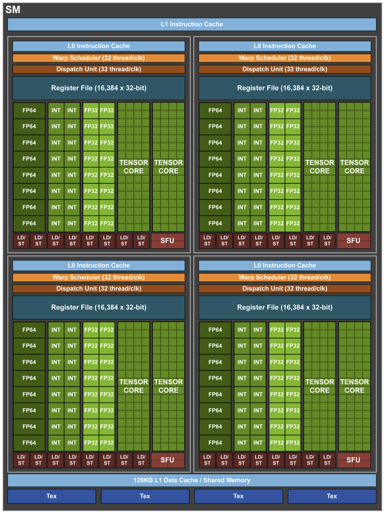

---
class: center, middle

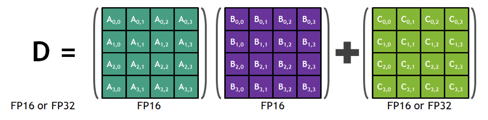

Tensor Core 4x4 Matrix Multiply and Accumulate

---
class: center, middle

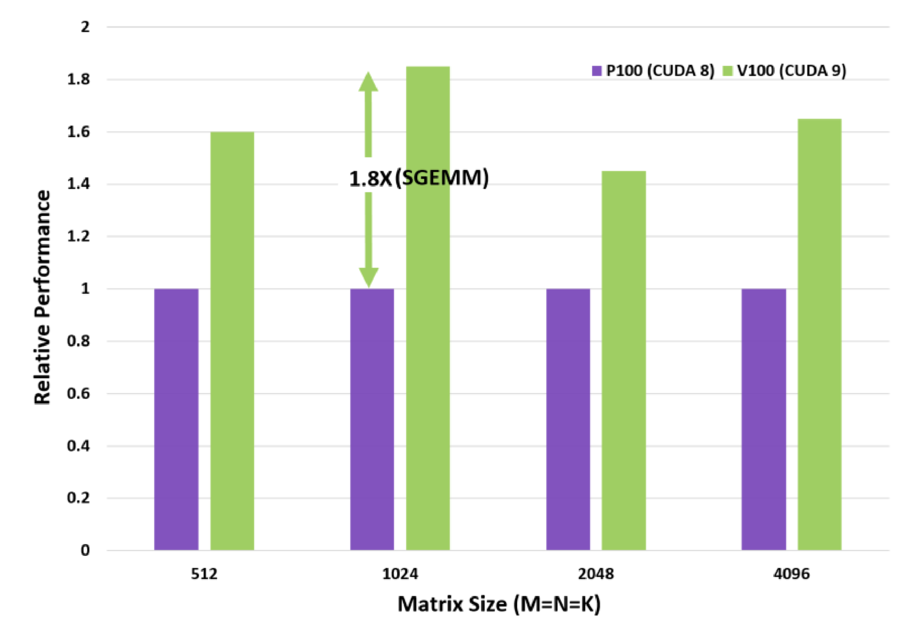

Single-precision (FP32) Matrix-Matrix Multiplies are up to 1.8x faster on Tesla V100 with CUDA 9 than on Tesla P100 with CUDA 8

---
class: center, middle

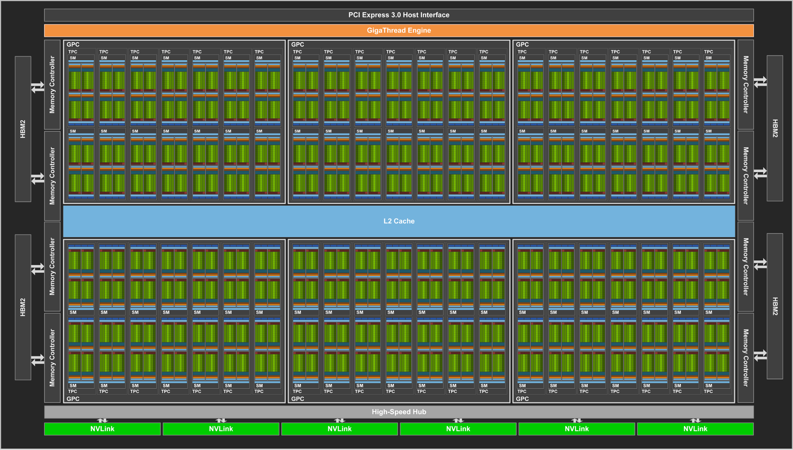

---
class: center, middle

80 SM

5,120 CUDA cores

640 tensor cores

---
class: center, middle

# Hierarchical breakdown of threads

---
class: center, middle

# Warp

Bottom-most level: 32 cores = 32 threads, grouped in a warp. 

The hardware is optimized to have all threads in a warp execute the same instruction at the same time. 

SIMT (single instruction multiple threads) model.

---
class: center, middle

# Block

Groups of warps form a block. A block executes on 1 SM (streaming multiprocessor). 

Threads within a block have some ability to exchange data and synchronize.

---
class: center, middle

# Grid

Collection of many blocks constitute the entire "dataset" that will be operated on by a kernel.

---
class: center, middle

# Execution model

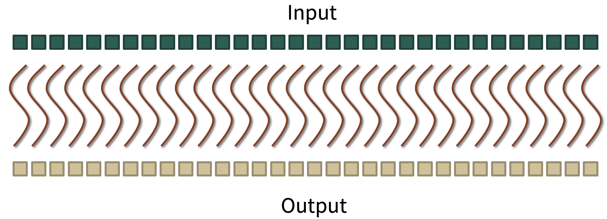

---
class: center, middle

# Let's get started!

---
class: middle

1. Setup Google Cloud Platform
2. Run the script [$ ./create_vm_gpu1.sh](https://github.com/stanford-cme213/stanford-cme213.github.io/blob/master/Code/create_vm_gpu1.sh)
3. Log on the instance: `$ gcloud compute ssh gpu1`

---
class: middle

Copy the file `Lecture_07.zip` to `gpu1`

On your VM:

`$ unzip Lecture_07.zip`

`$ make`

---
class: middle

Run

`./deviceQuery`

`./bandwidthTest`

---
class: middle

```
darve@gpu1:~/Lecture_07$ ./deviceQuery 
./deviceQuery Starting...

 CUDA Device Query (Runtime API) version (CUDART static linking)

Detected 1 CUDA Capable device(s)

Device 0: "Tesla K80"
  CUDA Driver Version / Runtime Version          10.2 / 10.2
  CUDA Capability Major/Minor version number:    3.7
  Total amount of global memory:                 11441 MBytes (11996954624 bytes)
  (13) Multiprocessors, (192) CUDA Cores/MP:     2496 CUDA Cores
  GPU Max Clock rate:                            824 MHz (0.82 GHz)
  Memory Clock rate:                             2505 Mhz
  Memory Bus Width:                              384-bit
  L2 Cache Size:                                 1572864 bytes
  ...
```

---
class: middle

```
darve@gpu1:~/Lecture_07$ ./bandwidthTest 
 [...]
 Host to Device Bandwidth, 1 Device(s)
 PINNED Memory Transfers
   Transfer Size (Bytes)	Bandwidth(GB/s)
   32000000			7.9

 Device to Host Bandwidth, 1 Device(s)
 PINNED Memory Transfers
   Transfer Size (Bytes)	Bandwidth(GB/s)
   32000000			10.7

 Device to Device Bandwidth, 1 Device(s)
 PINNED Memory Transfers
   Transfer Size (Bytes)	Bandwidth(GB/s)
   32000000			157.1

Result = PASS
```

---
class: center, middle

[firstProgram.cu](https://github.com/stanford-cme213/stanford-cme213.github.io/blob/master/Code/Lecture_07/firstProgram.cu)

---
class: center, middle

`checkCudaErrors(...)`

CUDA functions often fail silently

Use this to check for errors before continuing

---
class: middle

```
    int* d_output;

    cudaMalloc(&d_output, sizeof(int) * N);

    kernel<<<1, N>>>(d_output);

    vector<int> h_output(N);
    cudaMemcpy(&h_output[0], d_output, sizeof(int) * N,
                               cudaMemcpyDeviceToHost);

    cudaFree(d_output);
```    

---
class: middle

```
kernel<<<1, N>>>(d_output);
```

`N` : number of threads to launch for function `kernel`

Threads are numbered 0 to $N-1$

---
class: middle

```
__device__ __host__
int f(int i) {
    return i*i;
}

__global__
void kernel(int* out) {
    out[threadIdx.x] = f(threadIdx.x);
}
```

---
class: center, middle

# `global` / `host` / `device`

 ???

---
class: middle

`__global__` kernel will be

- Executed on the device
- Callable from the host

---
class: middle

`__host__` kernel will be

- Executed on the host
- Callable from the host

---
class: middle

`__device__` kernel will be

- Executed on the device
- Callable from the device only

---
class: center, middle

Get information about the current thread

Use the built-in variable `threadIdx`

We will learn more about this later

---
class: middle

Run

```
darve@gpu1:~/Lecture_07$ ./firstProgram -N=32
Using 32 threads = 1 warps
Entry          0, written by thread     0
...
Entry        961, written by thread    31
```

---
class: middle

```
darve@gpu1:~/Lecture_07$ ./firstProgram -N=1024
Using 1024 threads = 32 warps
Entry          0, written by thread     0
...
Entry    1046529, written by thread  1023
```

---
class: middle

```
darve@gpu1:~/Lecture_07$ ./firstProgram -N=1025
Using 1025 threads = 33 warps
CUDA error at firstProgram.cu:48 code=9(cudaErrorInvalidConfiguration) 
    "cudaGetLastError()" 
```

!!!