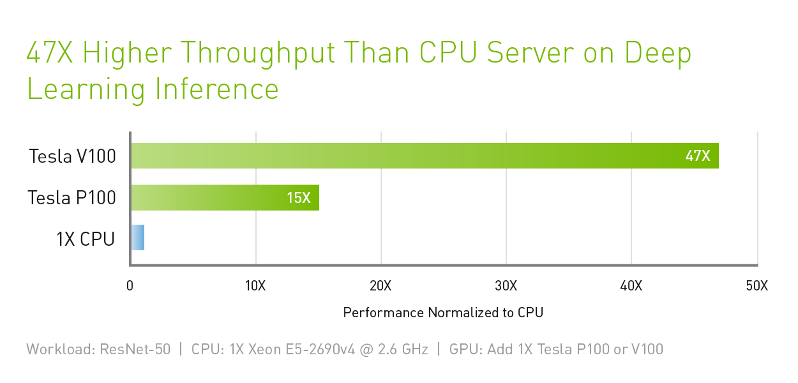

class: center, middle

# CME 213, ME 339 - Winter 2020

## Eric Darve, ICME


“If debugging is the process of removing bugs, then programming must be the process of putting them in.”
(Edsger W. Dijkstra)

---
class: middle, center

Before we start...

Download from `Code/`

[Code/create_vm_gpu1.sh](https://github.com/stanford-cme213/stanford-cme213.github.io/blob/master/Code/create_vm_gpu1.sh)

Run 

```
$ ./create_vm_gpu1.sh
```

on your laptop.

---
class: middle

CME 213 so far:

- C++ threads
- OpenMP: `for` loop and `task`
- Sorting algorithms on shared memory

Onwards to GPU computing!

---
class: middle, center


---
class: middle, center

Reference

https://github.com/karlrupp/cpu-gpu-mic-comparison

https://www.karlrupp.net/2013/06/cpu-gpu-and-mic-hardware-characteristics-over-time/

https://www.karlrupp.net/2015/06/40-years-of-microprocessor-trend-data/

---
class: middle, center


---
class: middle, center


---
class: middle, center


---
class: middle, center


---
class: middle, center


---
class: img-right


# Example: Volta V100

- 8.2 teraflops double-precision performance
- 16.4 teraflops single-precision performance
- 130 teraflops for tensor (deep learning)
- 1134 GB/sec memory bandwidth
- 250 Watts power

---
class: middle, center


---
class: middle, center



---
class: middle, center

# What is the technology behind GPU processors?

