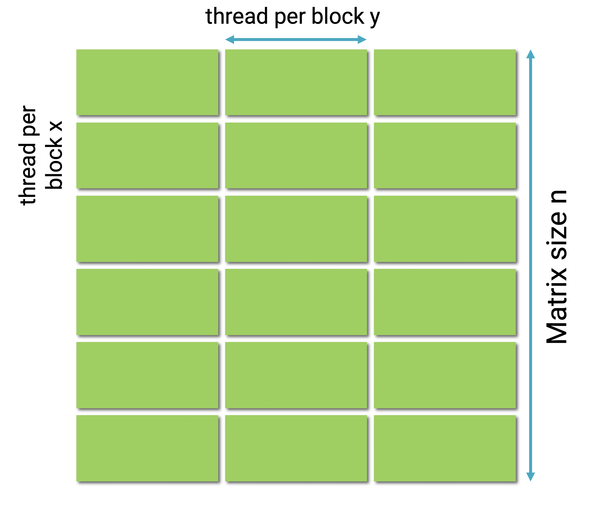
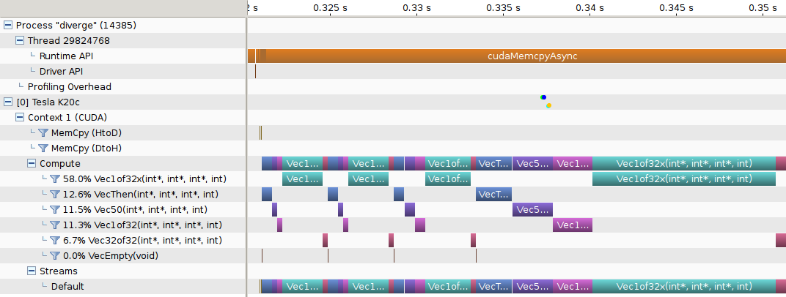

class: center, middle

# CME 213, ME 339 - Winter 2020

## Eric Darve, ICME


“There are two ways to write error-free programs; only the third one works.”
(Alan J. Perlis)

---
class: center, middle

# Let's get started!

---
class: middle

1. Setup Google Cloud Platform
2. Run the script [$ ./create_vm_gpu1.sh](https://github.com/stanford-cme213/stanford-cme213.github.io/blob/master/Code/create_vm_gpu1.sh)
3. Log on the instance: `$ gcloud compute ssh gpu1`

---
class: middle

Copy the file [Lecture_08.zip](https://github.com/stanford-cme213/stanford-cme213.github.io/blob/master/Code/Lecture_08.zip) to `gpu1`

On your VM:

`$ unzip Lecture_08.zip`

`$ make`

---
class: middle

Run

`./deviceQuery`

`./bandwidthTest`

---
class: middle

```
darve@gpu1:~/Lecture_08$ ./deviceQuery 
./deviceQuery Starting...

 CUDA Device Query (Runtime API) version (CUDART static linking)

Detected 1 CUDA Capable device(s)

Device 0: "Tesla K80"
  CUDA Driver Version / Runtime Version          10.2 / 10.2
  CUDA Capability Major/Minor version number:    3.7
  Total amount of global memory:                 11441 MBytes (11996954624 bytes)
  (13) Multiprocessors, (192) CUDA Cores/MP:     2496 CUDA Cores
  GPU Max Clock rate:                            824 MHz (0.82 GHz)
  Memory Clock rate:                             2505 Mhz
  Memory Bus Width:                              384-bit
  L2 Cache Size:                                 1572864 bytes
  ...
```

---
class: middle

```
darve@gpu1:~/Lecture_08$ ./bandwidthTest 
 [...]
 Host to Device Bandwidth, 1 Device(s)
 PINNED Memory Transfers
   Transfer Size (Bytes)	Bandwidth(GB/s)
   32000000			7.9

 Device to Host Bandwidth, 1 Device(s)
 PINNED Memory Transfers
   Transfer Size (Bytes)	Bandwidth(GB/s)
   32000000			10.7

 Device to Device Bandwidth, 1 Device(s)
 PINNED Memory Transfers
   Transfer Size (Bytes)	Bandwidth(GB/s)
   32000000			157.1

Result = PASS
```

---
class: center, middle

[firstProgram.cu](https://github.com/stanford-cme213/stanford-cme213.github.io/blob/master/Code/Lecture_08/firstProgram.cu)

---
class: center, middle

`checkCudaErrors(...)`

CUDA functions often fail silently

Use this to check for errors before continuing

---
class: middle

```
    int* d_output;

    cudaMalloc(&d_output, sizeof(int) * N);

    kernel<<<1, N>>>(d_output);

    vector<int> h_output(N);
    cudaMemcpy(&h_output[0], d_output, sizeof(int) * N,
                               cudaMemcpyDeviceToHost);

    cudaFree(d_output);
```    

---
class: middle

```
kernel<<<1, N>>>(d_output);
```

`N` : number of threads to launch for function `kernel`

Threads are numbered 0 to $N-1$

---
class: middle

```
__device__ __host__
int f(int i) {
    return i*i;
}

__global__
void kernel(int* out) {
    out[threadIdx.x] = f(threadIdx.x);
}
```

---
class: center, middle

# `global` / `host` / `device`

 ???

---
class: middle

`__global__` kernel will be

- Executed on the device
- Callable from the host

---
class: middle

`__host__` kernel will be

- Executed on the host
- Callable from the host

---
class: middle

`__device__` kernel will be

- Executed on the device
- Callable from the device only

---
class: center, middle

Get information about the current thread

Use the built-in variable `threadIdx`

We will learn more about this later

---
class: middle

Run

```
darve@gpu1:~/Lecture_08$ ./firstProgram -N=32
Using 32 threads = 1 warps
Entry          0, written by thread     0
...
Entry        961, written by thread    31
```

---
class: middle

```
darve@gpu1:~/Lecture_08$ ./firstProgram -N=1024
Using 1024 threads = 32 warps
Entry          0, written by thread     0
...
Entry    1046529, written by thread  1023
```

---
class: middle

```
darve@gpu1:~/Lecture_08$ ./firstProgram -N=1025
Using 1025 threads = 33 warps
CUDA error at firstProgram.cu:48 code=9(cudaErrorInvalidConfiguration) 
    "cudaGetLastError()" 
```

!!!

---
class: center, middle

Let's consult the K80 data sheet

[K80](https://stanford-cme213.github.io/k80.html)

---
class: center, middle

```
kernel<<<1, N>>>(d_output);
```

What we need is

```
kernel<<<num_blocks, block_size>>>(d_output);
```

---
class: center, middle

```
kernel<<<num_blocks, block_size>>>(d_output);
```

`block_size` can be at most 1,024

Use more blocks!

---
class: middle

Calculation should be organized into:

- blocks that fit on each SM (limited number of threads)
- several blocks forming a grid (so that an "unlimited" number of threads can be used)

---
class: center, middle


---
class: middle

# Defining dimensions

```
dim3 threadsPerBlock(Nx);
dim3 numBlocks(Mx);

dim3 threadsPerBlock(Nx, Ny);
dim3 numBlocks(Mx, My);

dim3 threadsPerBlock(Nx, Ny, Nz);
dim3 numBlocks(Mx, My, Mz);
```

---
class: center, middle

Let's use this to write a program to add two matrices

---
class: center, middle



---
class: middle

```
dim3 threads_per_block(2, n_thread);

int blocks_per_grid_x = (n + 2 - 1) / 2;
int blocks_per_grid_y = (n + n_thread - 1) / n_thread;

dim3 num_blocks(blocks_per_grid_x, blocks_per_grid_y);

Add<<<num_blocks, threads_per_block>>>(n, d_a, d_b, d_c);
```

---
class: center, middle

Math formula for number of blocks

`num_blocks = `</br>
`(num_threads_total + num_thread_per_block - 1)`</br>
`/ num_thread_per_block`

Try out with</br>
`num_threads_total = 5`</br>
`num_thread_per_block = 4`

---
class: middle

```
__global__
void Add(int n, int* a, int* b, int* c) {
    int i = blockIdx.x * blockDim.x + threadIdx.x;
    int j = blockIdx.y * blockDim.y + threadIdx.y;
    if(i < n && j < n) {
        c[n*i + j] = a[n*i + j] + b[n*i + j];
    }
}
```

---
class: middle

Built-in variable | Description
--- | ---
threadIdx | thread index in block
blockDim | number of threads in a block 
blockIdx | block index in grid
gridDim | number of blocks in grid
warpSize | number of threads in a warp

---
class: center, middle

STL `vector` cannot be used with CUDA

CUDA has its own mechanism to allocate and manage memory

See [Thrust](https://docs.nvidia.com/cuda/thrust/index.html) for an STL like vector implementation in CUDA

---
class: center, middle

# Compiling CUDA code

---
class: center, middle


---
class: center, middle

Most CPUs offer binary code compatibility and rely on a published instruction set architecture.

A given compiled code can run on many different processors.

---
class: center, middle

The situation is different with GPUs.

GPU improvements mean that binaries for different processors are incompatible.

---
class: middle

Compilation happens in two stages:

1. Code for virtual architecture is generated; PTX
2. Code for real architecture is generated

PTX assembly code relies on a specific set of features or GPU capabilities

Real architecture: binary code that can be executed on a given GPU

---
class: center, middle


---
class: middle

When compiling:

- one virtual architecture is chosen
- some (or none) real architectures are specified

---
class: center, middle

If a real architecture is compiled and matches the GPU, the binary is loaded and runs!

If a real architecture for the GPU is missing, a matching GPU binary code is generated when the application is launched using the PTX code.

This is called `just-in-time` compilation.

---
class: center, middle

Virtual architecture names start with `compute_`

Real architecture names start with `sm_`

---
class: center, middle

Example

`nvcc a.cu --gpu-architecture=compute_50 --gpu-code=sm_50,sm_52`

Generate code for two GPUs: `sm_50`, `sm_52`

---
class: center, middle

On GCP, try

`--gpu-architecture=compute_50 --gpu-code=sm_50`

---
class: center, middle

`--gpu-architecture=compute_50 --gpu-code=sm_50`

Fails because our GPU is `sm_37`

---
class: center, middle

Try

`--gpu-architecture=compute_50 --gpu-code=sm_37`

---
class: center, middle

`--gpu-architecture=compute_50 --gpu-code=sm_37`

Fails because `sm_37` does not support `compute_50` features

---
class: center, middle

Try

`--gpu-architecture=compute_37 --gpu-code=sm_50`

---
class: center, middle

Fails because wrong `sm`

---
class: center, middle

Try

`--gpu-architecture=compute_37 --gpu-code=compute_37,sm_50`

---
class: center, middle

Succeeds

Why?

---
class: center, middle

Wrong `sm_50`; but PTX for `compute_37` is loaded

Can be JIT compiled for `sm_37`

Win!

---
class: center, middle

`--gpu-architecture=compute_37 --gpu-code=sm_37`

Compile just for our GPU

---
class: center, middle

`--gpu-architecture arch (-arch)` 

shorthand

---
class: center, middle

`--gpu-architecture=sm_37`

is equivalent to

`--gpu-architecture=compute_37 --gpu-code=sm_37,compute_37`

Generate binary for `sm_37` + PTX for JITs on GPUs that support `compute_37`

---
class: center, middle

`--gpu-architecture=compute_37`

is equivalent to

`--gpu-architecture=compute_37 --gpu-code=compute_37`

Only generate and embed PTX; JIT required for all GPUs

---
class: center, middle

Recommended 

`--gpu-architecture=compute_37 --gpu-code=sm_37`

Shorter option (which embeds the PTX with the binary)

`-arch=sm_37`

---
class: center, middle

[List of virtual architectures](https://docs.nvidia.com/cuda/cuda-compiler-driver-nvcc/index.html#virtual-architecture-feature-list)

[List of real architectures](https://docs.nvidia.com/cuda/cuda-compiler-driver-nvcc/index.html#gpu-feature-list)

---
class: center, middle

Compiler options | Description
--- | ---
-g | Debug on the host
-G | Debug on the device (CUDA-gdb, Nsight Eclipse Edition)
-pg | Profiling info for use with gprof (Linux)
-Xcompiler | Options for underlying gcc compiler
-O | Optimization level

---
class: center, middle

[Visual Profiler](https://docs.nvidia.com/cuda/profiler-users-guide/index.html)



---
class: center, middle

[CUDA-MEMCHECK](https://docs.nvidia.com/cuda/cuda-memcheck/index.html)

Tool | Description
--- | ---
memcheck | Memory access error and leak detection
racecheck | Shared memory data access hazard detection
initcheck | Unitialized device global memory access detection
synccheck | Thread synchronization hazard detection