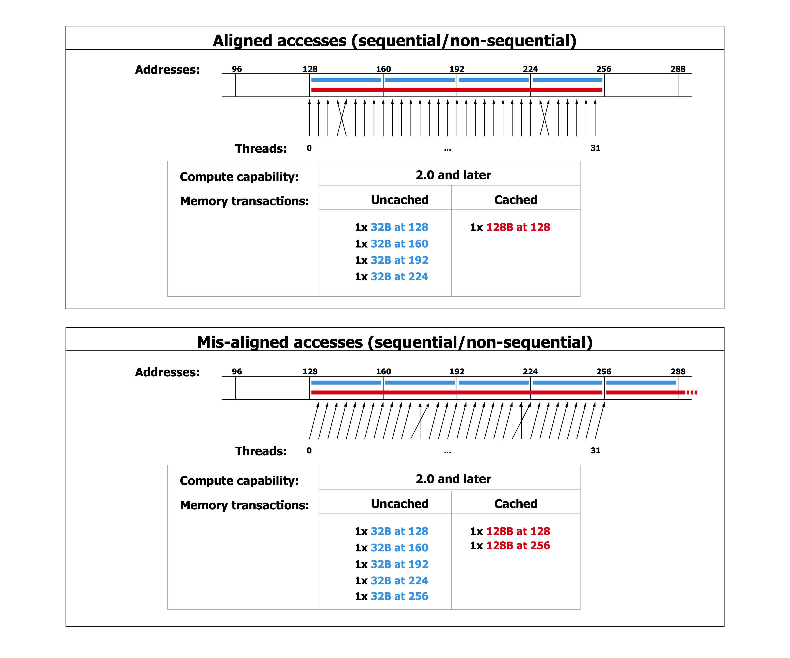
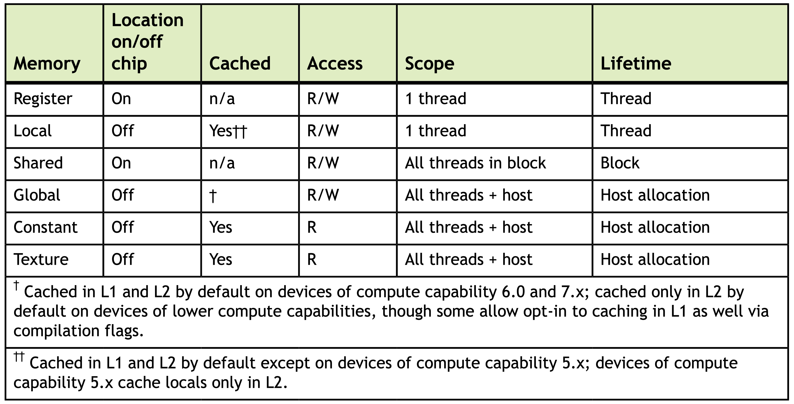
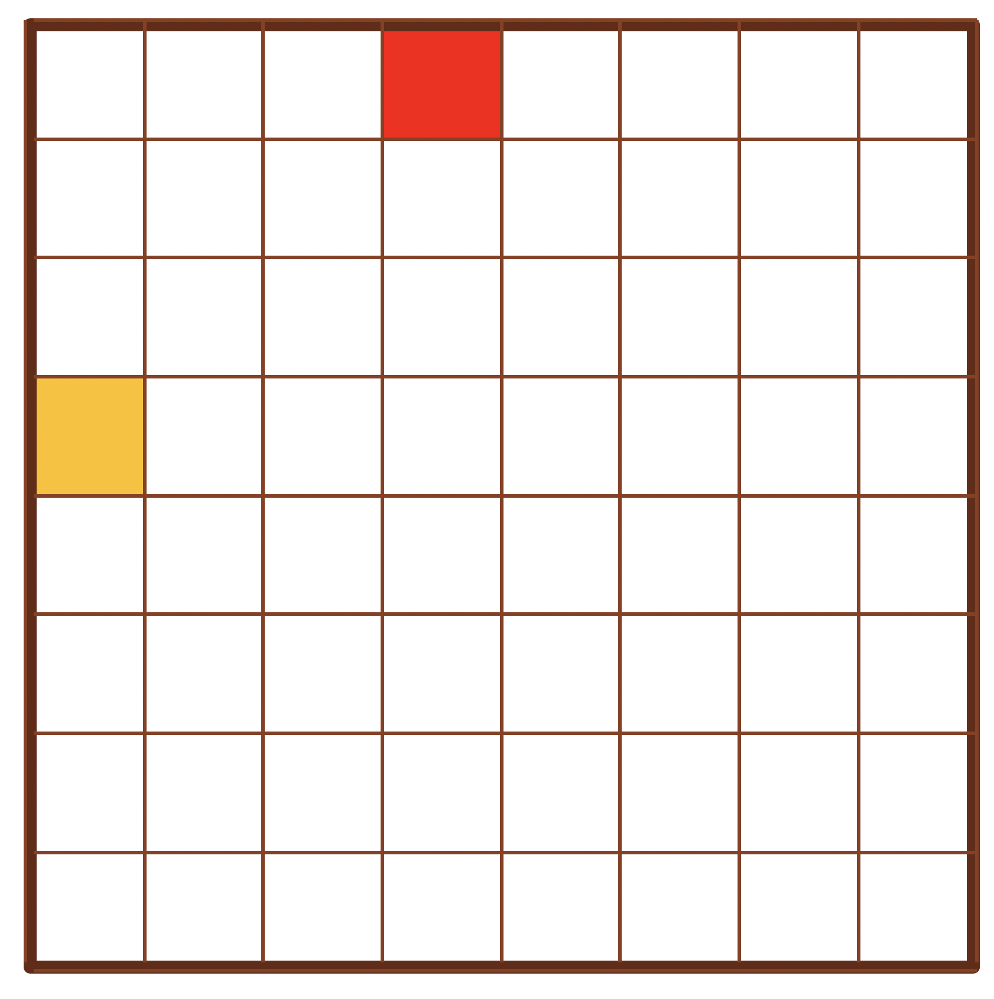
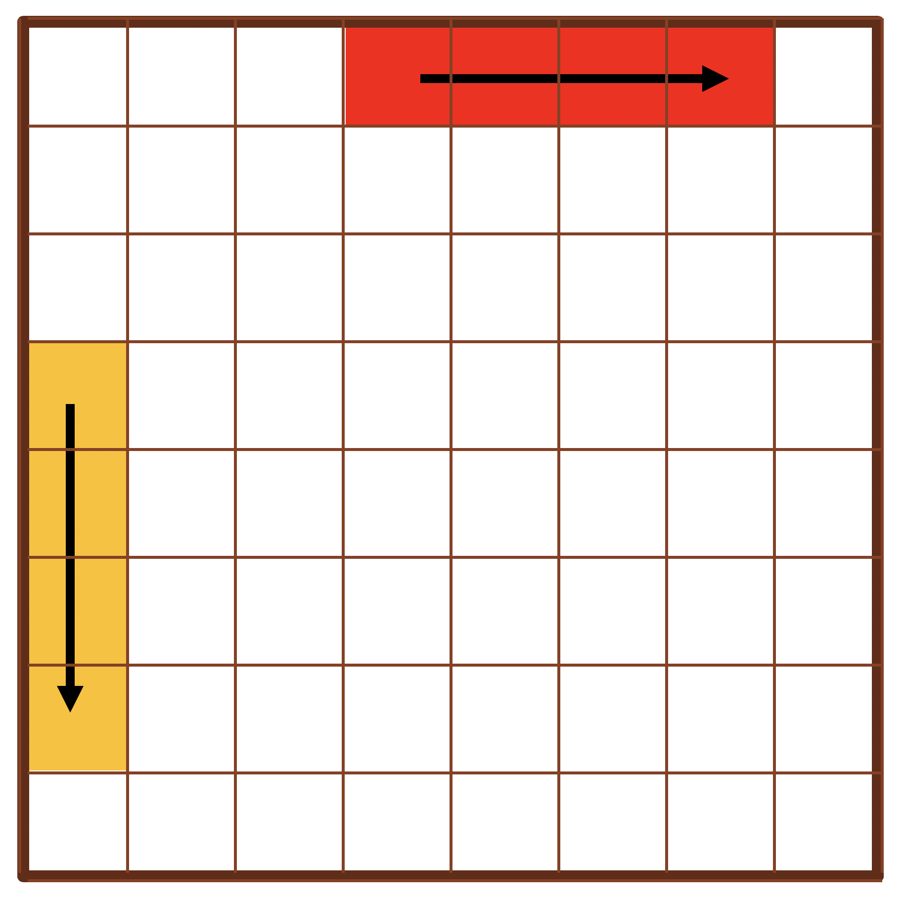
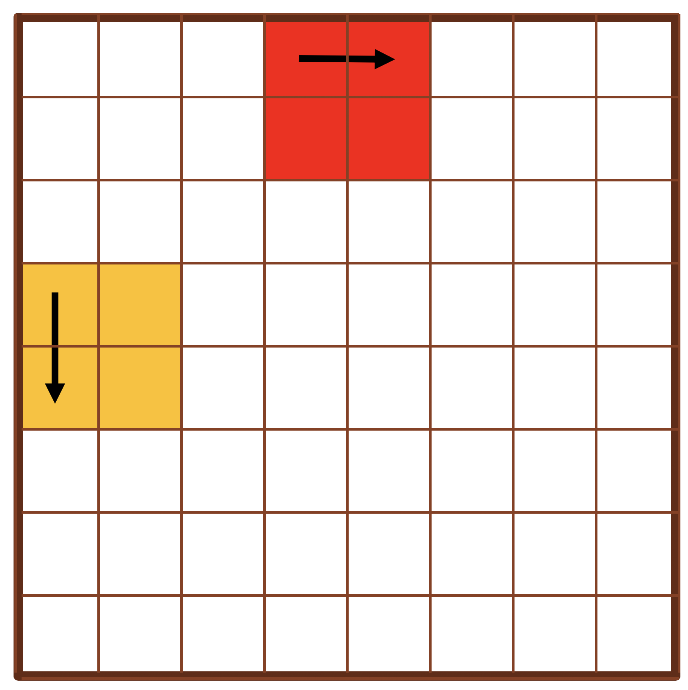
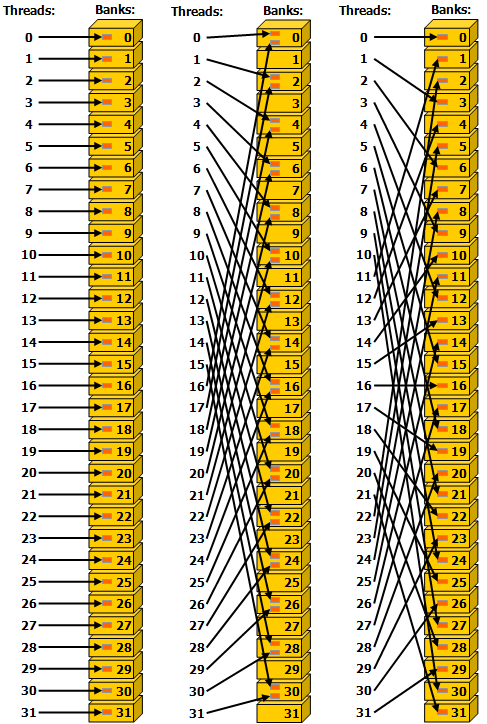
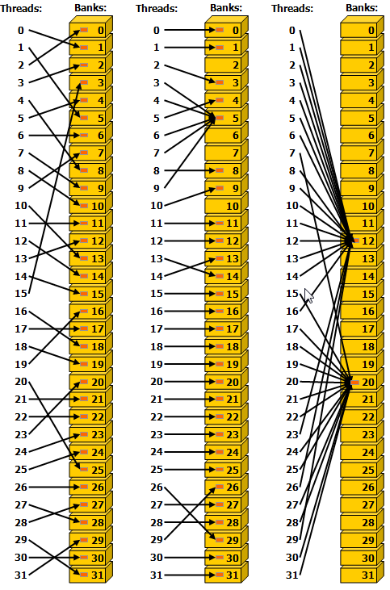

class: center, middle

# CME 213, ME 339 - Winter 2020

## Eric Darve, ICME


“You can either have software quality or you can have pointer arithmetic, but you cannot have both at the same time.”
(Bertrand Meyer)

---
class: center, middle

GPU Optimization


---
class: center, middle

Optimize data transfer from GPU memory

---
class: middle

- Caches are used to optimize memory accesses: L1 and L2 caches.
- Cache behavior is complicated and depends on the compute capability of the GPU.
- We will focus on `sm_37`

---
class: center, middle

# L1 cache

Used primarily for local memory, including temporary register spills

---
class: center, middle

# L2 cache

Cache accesses to local and global memory

---
class: center, middle

The smallest size for a memory transaction is 32 bytes.

That's 8 floats!

---
class: middle

Let's make this concrete with a code

```
  int xid = blockIdx.x * blockDim.x + threadIdx.x;
  if (xid < n)
      odata[xid] = idata[xid];
```

---
class: center, middle

Warp requests several memory addresses

These are translated into cache line requests (with a granularity of 32 bytes)

Memory requests are serviced 

---
class: center, middle



---
class: middle

Benchmark: offset access

```
int xid = blockIdx.x * blockDim.x + threadIdx.x + offset;
if (xid < n)
    odata[xid] = idata[xid];
```

---
class: middle

```
Elapsed time for offset   0 in msec:     4.5359
Elapsed time for offset   1 in msec:     6.8373
Elapsed time for offset   2 in msec:     6.8377
Elapsed time for offset  32 in msec:     4.5360
Elapsed time for offset  64 in msec:     4.5384
Elapsed time for offset 128 in msec:     4.5398
```

---
class: middle

Benchmark: strided access

```
int xid = stride * (blockIdx.x * blockDim.x + threadIdx.x);
if (xid < n)    
    odata[xid] = idata[xid];
```

---
class: middle

```
Elapsed time for stride   1 in msec:     1.9950
Elapsed time for stride   2 in msec:     2.7842
Elapsed time for stride   4 in msec:     4.0088
Elapsed time for stride   8 in msec:     6.5526
Elapsed time for stride  16 in msec:     7.4371
```

---
class: center, middle



---
class: center, middle

Homework 3

Interpreting performance numbers is not an easy task

---
class: center, middle

# Memory access

Are memory addresses for threads in a warp contiguous?

**Coalesced memory access**

Is there a stride or offset?

---
class: center, middle

# Instruction throughput

Memory requests are executed by LD/ST units

---
class: middle

```
ld.global.f32 r,[x];
```

Load register variable `r` from source address `x`

---
class: middle

```
st.global.f32 [x],r;
```

Store register variable `r` in destination address `x`

---
class: center, middle

For `char` case, instruction throughput is the limiting factor.

---
class: center, middle

For `int/int2` cases, memory throughput is the limiting factor.

---
class: center, middle

Let’s put all these concepts into play through a specific example: a matrix transpose.

It’s all about bandwidth!

---
class: center, middle



---
class: center, middle

Even for such a simple calculation, there are many optimizations.

---
class: middle

```
const int tid = threadIdx.x + blockDim.x * blockIdx.x;
int col = tid % n_cols;
int row = tid / n_cols;
if(col < n_cols && row < n_rows) {
    array_out[col * n_rows + row] = array_in[row * n_cols + col];
}
```

---
class: center, middle



---
class: center, middle

Read 

Write  

---
class: center, middle

2D kernel



---
class: middle

```
const int col = threadIdx.x + blockDim.x * blockIdx.x;
const int row = threadIdx.y + blockDim.y * blockIdx.y;

if(col < n_cols && row < n_rows) {
    array_out[col * n_rows + row] = array_in[row * n_cols + col];
}
```  

---
class: middle

```
dim3 block_dim(8, 32);
dim3 grid_dim(n / 8, n / 32);
```

---
class: middle

For a given warp:

- column: 0 to 7
- row: 0 to 3

Read 

Write   

---
class: middle

Benchmark

    darve@gpu1:~/Lecture_09$ make && ./transpose 
    nvcc -Icuda_helper -O3 -arch=sm_37 -o transpose transpose.cu
    Number of MB to transpose: 64

    Bandwidth bench
    GPU took 1.02463 ms
    Effective bandwidth is 130.992 GB/s

    simpleTranspose
    GPU took 49.2308 ms
    Effective bandwidth is 29.9893 GB/s

    simpleTranspose2D
    GPU took 16.9634 ms
    Effective bandwidth is 87.034 GB/s

---
class: center, middle

Can we reconcile read and write?


---
class: center, middle

Load in fast **shared memory**

Transpose from **shared memory** is very fast!

---
class: center, middle

Shared memory


---
class: center, middle

# Facts

On-chip: high bandwidth, low latency

Data in shared memory is only accessible by threads in the same thread block!

---
class: middle

```
const int warp_id  = threadIdx.y;
const int lane     = threadIdx.x;

__shared__ int block[warp_size][warp_size];
```  

`lane`: id of thread inside warp

`block`: variable allocated in shared memory

---
class: middle

# Load data

```
int gc = bc * warp_size + lane; // Global column index
for(int i = 0; i < warp_size / num_warps; ++i) {
    int gr = br * warp_size + i * num_warps + warp_id; // Global row index
    block[i * num_warps + warp_id][lane] = array_in[gr * n_cols + gc];
}
__syncthreads();
```

---
class: middle

# Store

```
int gr = br * warp_size + lane;

for(int i = 0; i < warp_size / num_warps; ++i) {
    int gc = bc * warp_size + i * num_warps + warp_id;
    array_out[gc * n_rows + gr] = block[lane][i * num_warps + warp_id];
}
```

---
class: middle

Performance

    Top bandwidth is 130.578 GB/s

    simpleTranspose
    GPU took 49.3109 ms
    Effective bandwidth is 29.9405 GB/s

    simpleTranspose2D
    GPU took 16.9566 ms
    Effective bandwidth is 87.0692 GB/s

    fastTranspose
    GPU took 17.133 ms
    Effective bandwidth is 86.1726 GB/s

---
class: center, middle


---
class: center, middle

Shared memory suffers from bank conflicts.

The shared memory is divided into equally-sized memory modules, called banks, which can be accessed simultaneously. 

---
class: center, middle


Any memory read or write request made of $n$ addresses that fall in $n$ distinct memory banks can be serviced simultaneously, yielding an overall bandwidth that is $n$ times as high as the bandwidth of a single module.

---
class: center, middle


If two addresses of a memory request fall in the same memory bank, there is a bank conflict and the access has to be serialized.

---
class: center, middle

Each bank has a bandwidth of 4 bytes per two clock cycles.

---
class: center, middle



---
class: center, middle



---
class: center, middle

```
block[i * num_warps + warp_id][lane] = array_in[gr * n_cols + gc];
```

Stride of 1


---
class: center, middle

```
array_out[gc * n_rows + gr] = block[lane][i * num_warps + warp_id];
```

Stride of 32


---
class: center, middle

The cure!


---
class: center, middle

```
__shared__ int block[warp_size][warp_size+1];
```


```
array_out[gc * n_rows + gr] = block[lane][i * num_warps + warp_id];
```

---
class: middle

`fastTranspose`

    Top bandwidth is 130.578 GB/s

    simpleTranspose
    GPU took 49.3109 ms
    Effective bandwidth is 29.9405 GB/s

    simpleTranspose2D
    GPU took 16.9566 ms
    Effective bandwidth is 87.0692 GB/s

    fastTranspose
    GPU took 17.133 ms
    Effective bandwidth is 121.714 GB/s