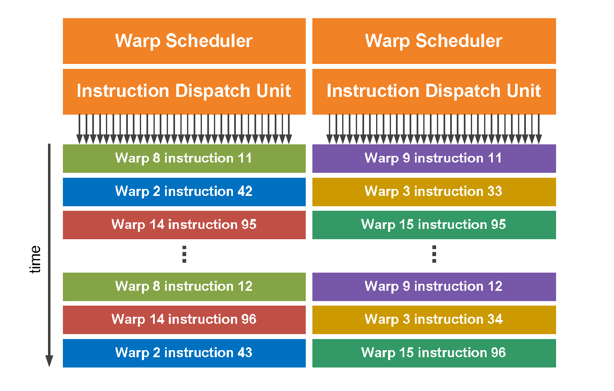

class: center, middle

# CME 213, ME 339 - Winter 2020

## Eric Darve, ICME

“Software is like entropy: It is difficult to grasp, weighs nothing, and obeys the Second Law of Thermodynamics; i.e., it always increases.”
(Norman Augustine)

---
class: center, middle

# Concurrency and latency

---
class: center, middle

Imagine you are a pencil manufacturer.

You outsource your manufacturing plants to China but your market is in the US.

How do you organize the logistics of the transport?

---
class: middle

Concurrency is used to hide long latencies:

- memory access
- floating point units
- any long sequence of operations

---
class: center, middle

Processors are optimized in the same way

Hide latency through concurrency

