class: center, middle

# CME 213, ME 339 - Winter 2020

## Eric Darve, ICME


“Software is like entropy: It is difficult to grasp, weighs nothing, and obeys the Second Law of Thermodynamics; i.e., it always increases.”
(Norman Augustine)

---
class: center, middle

# Concurrency and latency

---
class: center, middle

Imagine you are a pencil manufacturer.

You outsource your manufacturing plants to China but your market is in the US.

How do you organize the logistics of the transport?


---
class: middle

Concurrency is used to hide long latencies:

- memory access
- floating point units
- any long sequence of operations

---
class: center, middle

Processors are optimized in the same way

Hide latency through concurrency


---
class: middle

How to maximize concurrency?

- Have as many live threads as possible
- Instruction-level parallelism

---
class: middle

# Hardware limits

- Max dim. of grid: y/z 65,535 (x is huge, $2^{31}−1$)
- Max dim. of block: x/y 1,024; z 64
- Max \# of threads per block: 1,024
- Max blocks per SM: 16
- Max resident warps: 64
- Max threads per SM: 2,048
- \# of 4-byte registers per block: 65,536 (128K per block)
- Max shared mem per block: 49,152 (112 KB per block)

---
class: center, middle

# How can we make sense of this?

---
class: middle

# CUDA API

Achieve best potential occupancy; recommended parameter selections

`cudaOccupancyMaxActiveBlocksPerMultiprocessor`

Number of blocks on each SM (based on given block size and shared memory usage)

---
class: middle

`cudaOccupancyMaxPotentialBlockSize`</br>
`cudaOccupancyMaxPotentialBlockSizeVariableSMem`

Minimum grid size and recommended block size to achieve maximum occupancy

---
class: center, middle

Occupancy spreadsheet!

[CUDA Occupancy Calculator](https://docs.nvidia.com/cuda/cuda-occupancy-calculator/CUDA_Occupancy_Calculator.xls)

---
class: center, middle

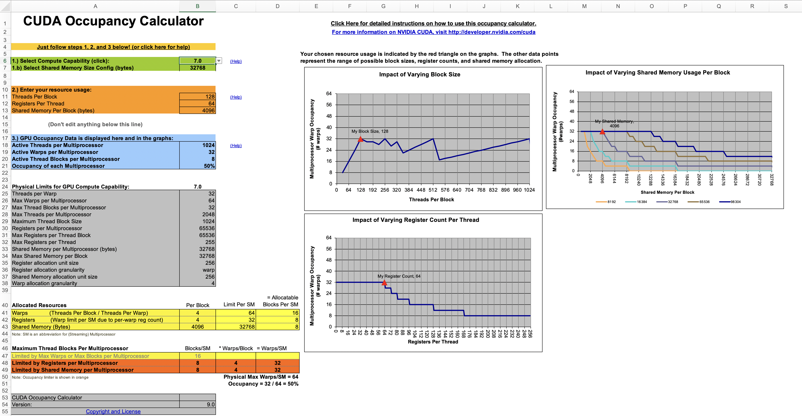

---
class: middle

Command line

    darve@gpu1:~/Lecture_09$ nvcc --ptxas-options=-v -Icuda_helper -O3 
       -arch=sm_37 -o transpose transpose.cu

`--ptxas-options=-v`

---
class: middle

Output
    
    ptxas info    : Compiling entry function '_Z13fastTransposeILi8EEvPiS0_ii' for 'sm_37'
    ptxas info    : Function properties for _Z13fastTransposeILi8EEvPiS0_ii
        0 bytes stack frame, 0 bytes spill stores, 0 bytes spill loads
    ptxas info    : Used 18 registers, 4096 bytes smem, 344 bytes cmem[0]

---
class: center, middle

Occupancy calculator demo

---
class: center, middle

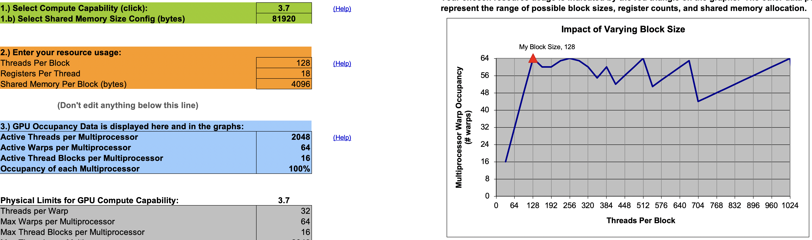

---
class: center, middle

# Branching and divergent execution path

32 threads = 1 warp

SIMT: Single Instruction, Multiple Thread

---
class: center, middle

Up to Pascal

Single program counter shared amongst all 32 threads

---
class: center, middle

# What happens with branches?

---
class: center, middle


---
class: center, middle

Active mask

Specifies which threads of the warp are active at any given time

---
class: center, middle

Execution becomes serialized

---
class: middle

```
__global__ void branch_thread(float* out){
  int tid = threadIdx.x;
  if (tid%2 == 0) {
     ...;
  } else {
     ...;
  }
}
```


---
class: middle

```
__global__ void branch_warp(float* out){
  int wid = threadIdx.x/32;
  if (wid%2 == 0) {
     ...;
  } else {
     ...;
  }
}
```


---
class: center, middle

# Volta!

Mitigates this problem a bit

But fundamentally performance hit is still significant

---
class: center, middle


---
class: center, middle

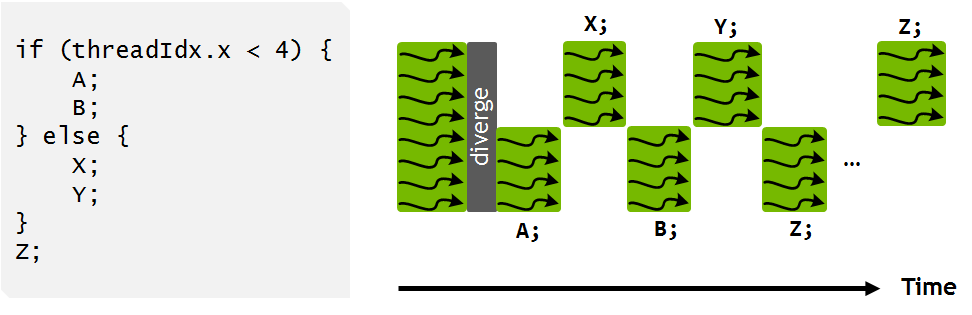

---
class: center, middle

Gives more flexibility in programming and performance

Avoids certain deadlock bugs due to divergence

---
class: middle

Volta allows the correct execution of many concurrent algorithms

Definition: **starvation-free algorithm**

Algorithms that are guaranteed to execute correctly so long as the system ensures that all threads have adequate access to a contended resource

---
class: middle

```
__device__ void insert_after(Node *a, Node *b)
{
    Node *c;
    lock(a); lock(a->next);
    c = a->next;

    a->next = b;
    b->prev = a;

    b->next = c;
    c->prev = b;

    unlock(c); unlock(a);
}
```

---
class: center, middle

Volta ensures that the thread holding the lock is able to make progress

---
class: center, middle

# Homework 4

$$ \frac{\partial T}{\partial t} = 
\frac{\partial^2 T}{\partial x^2} +
\frac{\partial^2 T}{\partial y^2}$$

Finite-difference

$$T^{n+1} = A T^n$$

---
class: center, middle

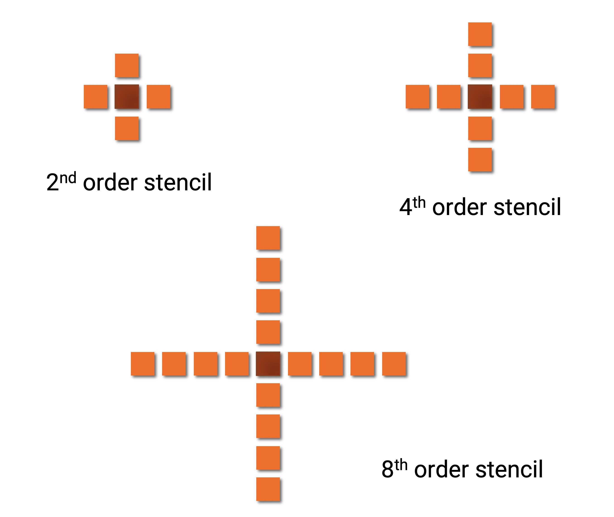

---
class: center, middle

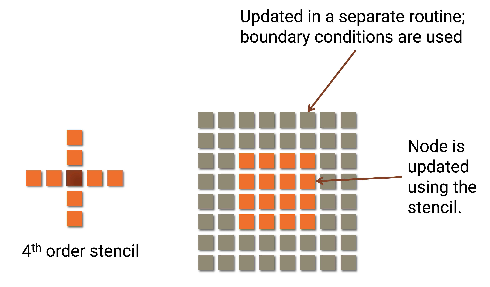

???
- The stencil can only be applied on the inside.
- Near the boundary a special stencil needs to be used (one-sided).
- To simplify the homework, we considered a case where the analytical solution is known.
- Nodes on the boundary are simply updated using the exact solution.

---
class: center, middle

Goal of the homework

Implement a CUDA routine to update nodes inside the domain using a finite-difference centered stencil

---
class: center, middle

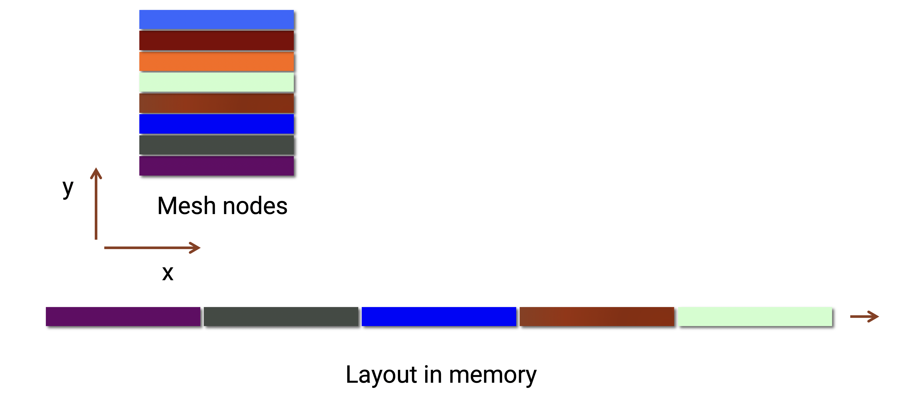

---
class: center, middle

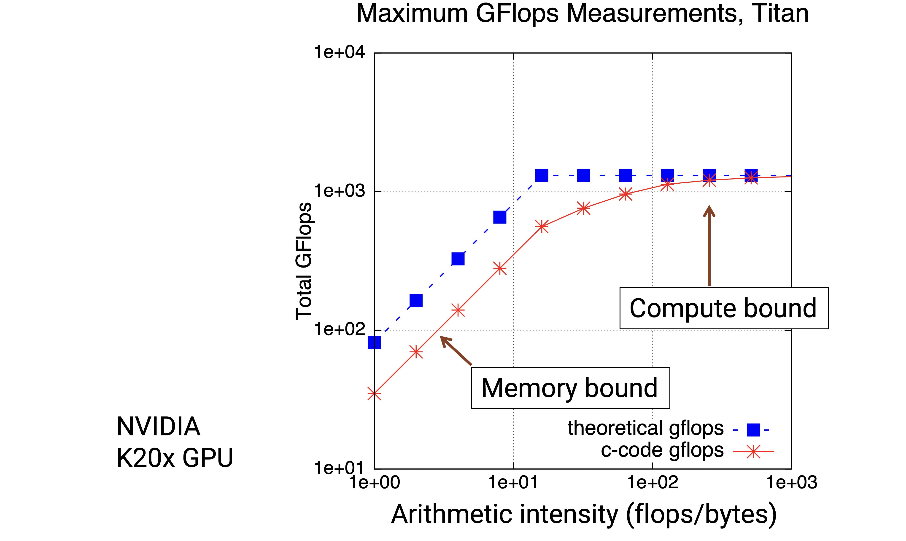

---
class: center, middle

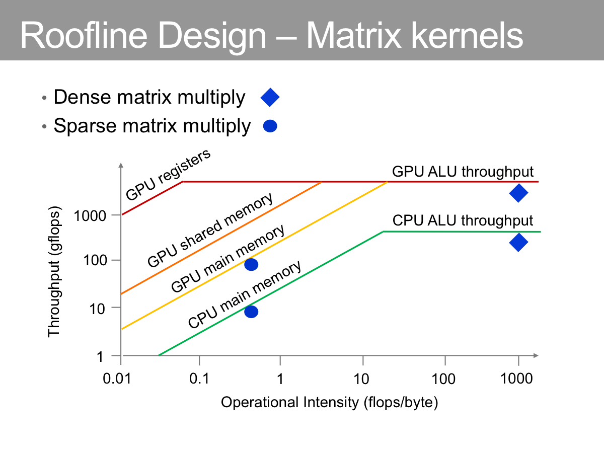

---
class: center, middle

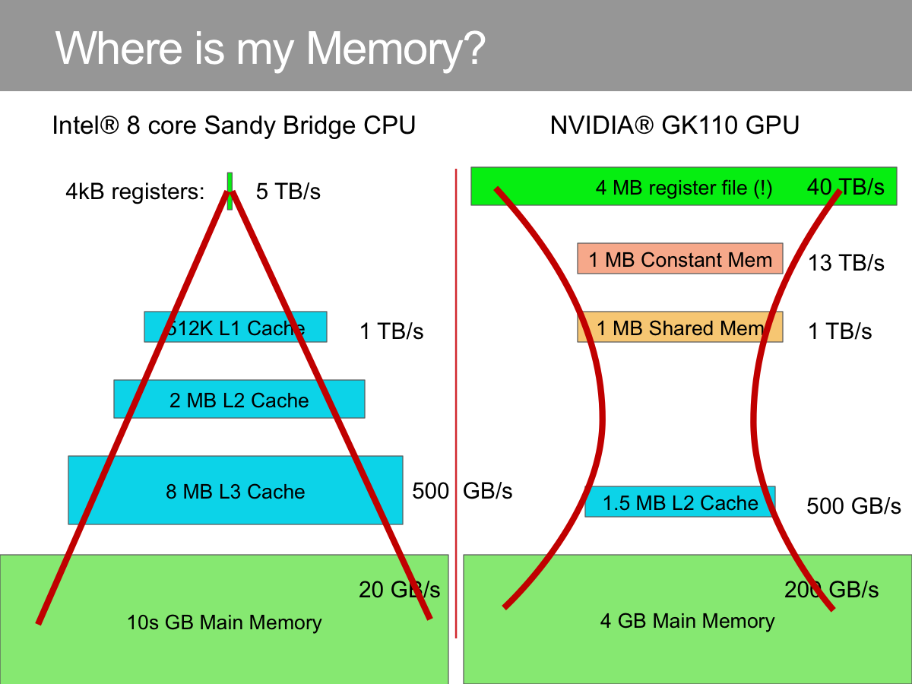

---
class: center, middle

# Where are we in the roofline plot?

---
class: center, middle

# Order 2 stencil

How many flops?

How many words?

---
class: middle

```
case 2:
    return curr[0] + xcfl * (curr[-1] + curr[1] - 2.f * curr[0]) +
            ycfl * (curr[width] + curr[-width] - 2.f * curr[0]);
```

---
class: middle

How many flops?

10 additions / multiplications

How many words?

- Read: 5
- Write: 1
- Total: 6

???
- Operations are very fast on the hardware.
- Threads are mostly going to wait on memory for this problem.
- How can we address this?

---
class: middle

# Two main ideas

1. Use cache or shared memory
2. Memory accesses should be coalesced

???
1. Use cache or shared memory:Once a data is read from memory and is in cache/shared memory, use it as much as possible, that is use it for several different stencils that need that point
2. Memory accesses should be coalesced: threads in a warp need to read from contiguous memory locations.

---
class: center, middle

# Idea 1

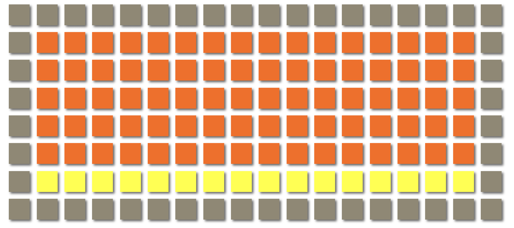

---
class: middle

- Thread-block = 16 threads.
- Reads: 16*3+2. Writes: 16. Total = 66
- Flops: 10*16 = 160
- Ratio: flops/word = 2.4

---
class: center, middle

# Idea 2

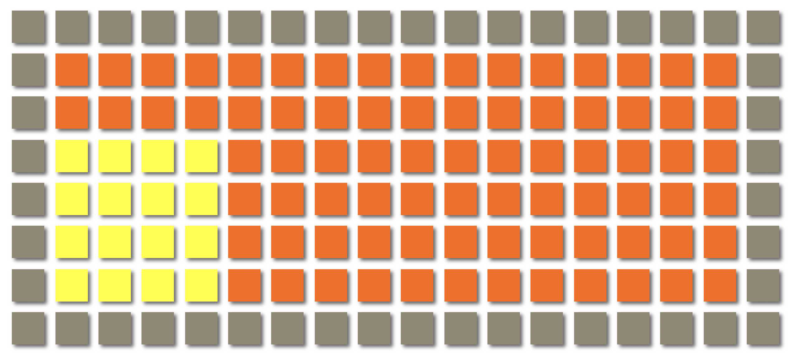

---
class: center, middle

# Improvement

Ratio: flops/word

2.4 &rarr; **3.3**

???
- Thread-block = 16 threads.
- Reads: 16+16. Writes: 16. Total = 48
- Flops: 10*16 = 160
- Ratio: flops/word = 3.3

---
class: middle

# Peak

For an $n \times n$ block:

- Memory traffic: $2n^2 + 4n$
- Flops: $10 n^2$

Maximum intensity: $5$ flops/words

???
- Kernel with higher-order compact stencils will have better performance.
- We see that for this problem, we cannot make the kernel compute bound. The peak bandwidth is going to be the limiting factor.

---
class: center, middle

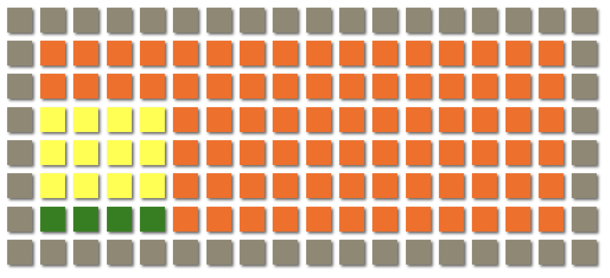

---
class: middle

Only mesh nodes along $x$ are contiguous.

This size must be a multiple of 32.

A warp must work on a chunk aligned along $x$.

---
class: center, middle

# Warp memory access

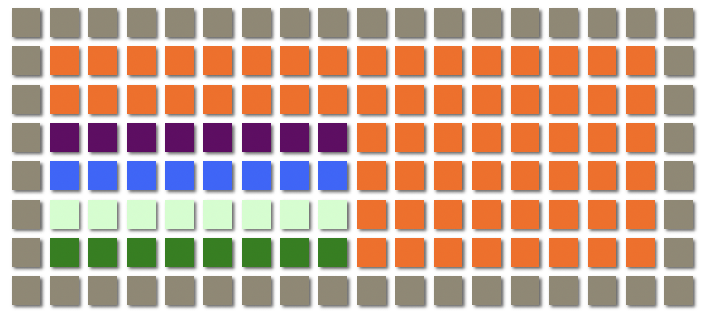

---
class: middle

Thread block should be rectangular

Along x: dimension &sim; 32

Along y: determines number of threads in block

Example: 512 &rarr; dimension y = 16

---
class: center, middle

# Check your bounds

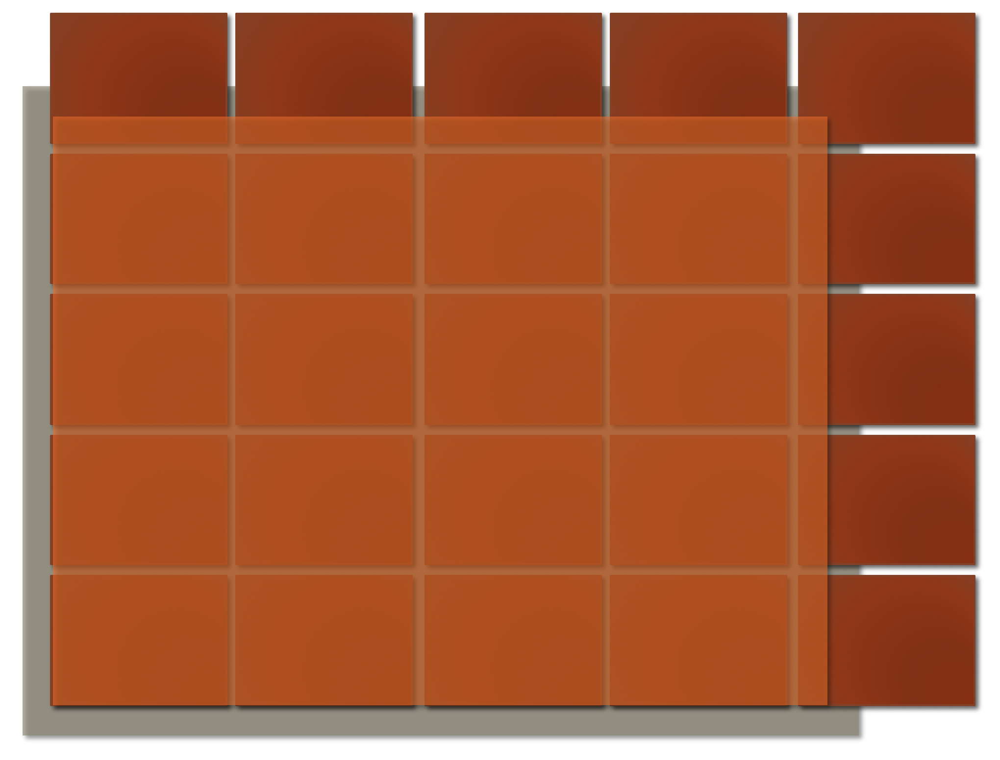

???
- Use an if statement to check whether the thread is inside or not
- If not, return.

---
class: center, middle

# Shared memory algorithm

---
class: center, middle

Step 1: all threads load data in shared memory


---
class: center, middle

Step 2: threads inside the domain apply the stencil and write to the output array

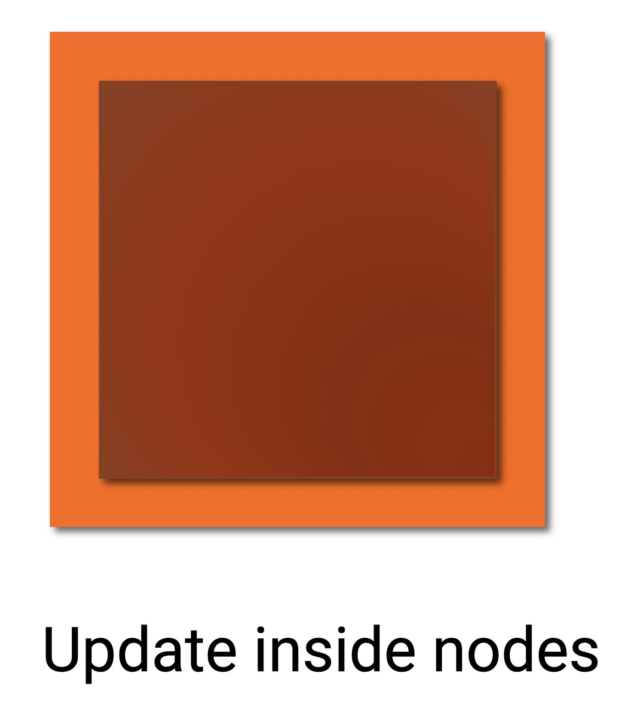

---
class: middle

Sample output

    $ ./main -gsb
    Order: 8, 4096x4096, 100 iterations
                time (ms)   GBytes/sec
        CPU     3801.21       31.7783
        Global   350.86      344.285
        Block    210.664     573.407
        Shared   144.618     835.279

                L2Ref      LInf          L2Err
        Global  0.447065   3.57628e-07   4.38207e-08
        Block   0.447065   3.57628e-07   4.38207e-08
        Shared  0.447065   3.57628e-07   4.38207e-08

???
To run the code you can use options -g -b or -s. 

This determines which GPU algorithm can run. g=global, b=block (algo. 2), s=shared

---
class: middle

Order 2

    $ ./main -gsb
    Order: 2, 4096x4096, 100 iterations
                time (ms)  GBytes/sec
        CPU     1811.65     22.2257
        Global   230.703   174.533
        Block    103.554   388.833
        Shared   93.2796   431.663

                L2Ref       LInf           L2Err
        Global  0.418194    2.98023e-07    4.87715e-08
        Block   0.418194    2.98023e-07    4.87715e-08
        Shared  0.418194    2.98023e-07    4.87715e-08        

---
class: center, middle

# What is the best blocking strategy?

Go as wide as you can along x while satisfying memory constraints

Then loop along y reusing loaded data

